# Moon Explorer
---

Welcome to Moon Explorer! This webpage is dedicated to providing interesting facts about the moon. Explore the mysteries and wonders of Earth's celestial companion.

Welcome to Moon Explorer! [visit the page ](https://mohamedaliabdikarim.github.io/Projeckt-one/)

## Introduction
Moon Explorer is a web project designed for people fascinated by the moon. Uncover captivating facts and trivia about our cosmic neighbor right here.

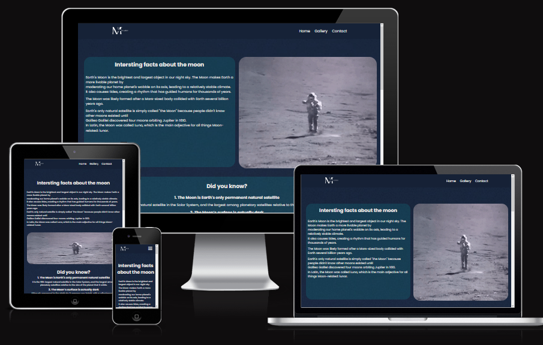
# Media
---
Dive into the moon's mesmerizing visuals with our collection of media content:

#  User Experience (UX)
---

### Wireframes
---
I created the wireframes for Moon using Figma, designing frames specifically for a full-width display. The final website deviates slightly from the original wireframes, reflecting adjustments made during the development proces
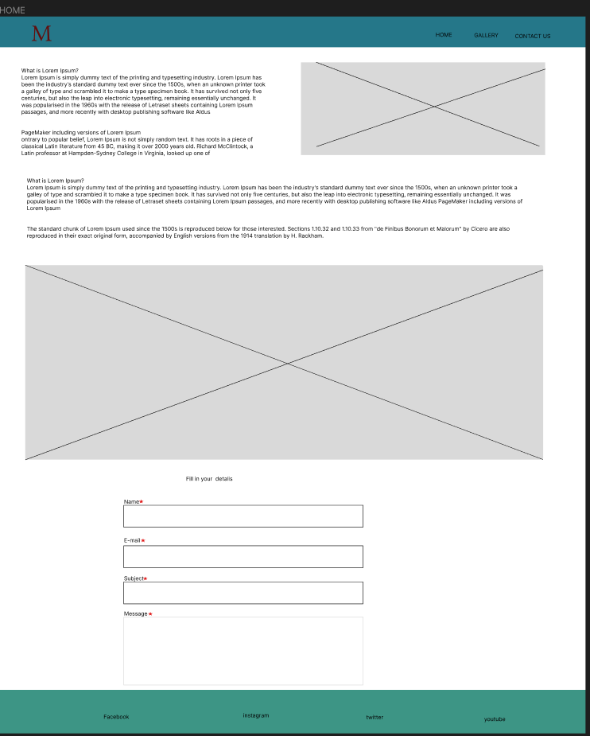
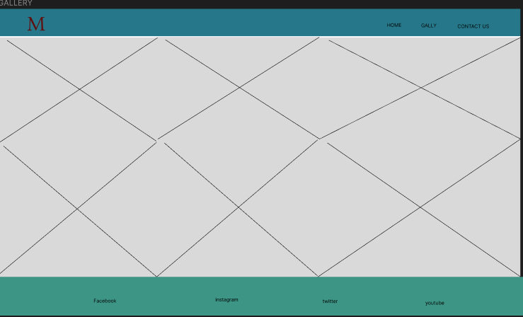

### Site Structure
---

The Moon website features a sleek design with two main sections, complemented by a convenient contact page located at the bottom of every page. Upon loading, the default landing page is the engaging home page. Navigating through the site is effortless, as the Gallery and Contact pages are prominently accessible from the well-organized navigation menu. Additionally, a direct link to the contact page is strategically placed for easy access.

### Design Choices

 - ### Typography

The selected fonts include 'Poppins' for the body text, with a fallback to 'sans-serif' in case 'Poppins' is unavailable.

- ### Clour choice

- The chosen colors are white and blue, aiming to mimic the sky and clouds.

# Usage
Navigate through the webpage to discover various moon-related content.[ Click on the media elements to view GIFs and videos, and enjoy the informative text sections](gallery.html).

## Installation
Moon Explorer is a web-based project, and no installation is required. Simply visit the project webpage [here](https://mohamedaliabdikarim.github.io/Projeckt-one/) to start exploring the moon.

## Contributing
Feel passionate about the moon? Contributions are welcome! Fork the repository, make your enhancements, and submit a pull request. Reach out to contact page.

## Contact
Have questions, suggestions, or just want to chat about the moon? Reach out to contact page.

Happy moon exploration!

# Features
---
Moon website has been designed to provide a welcoming and user-friendly experience. It incorporates familiar elements like a navigation bar and a contact form to enhance ease of use. The overall ambiance of the website aims to be inviting, ensuring a non-intimidating atmosphere that encourages users to explore its content more deeply.

### Navigation Menu:
---

- Positioned at the top of each page on the site, the navigation menu is fully responsive and features links to all pages for effortless navigation from a centralized location. The clickable logo further enriches the user experience by offering a direct link back to the home page, contributing to a seamless and user-friendly website navigation.

- for small small devices

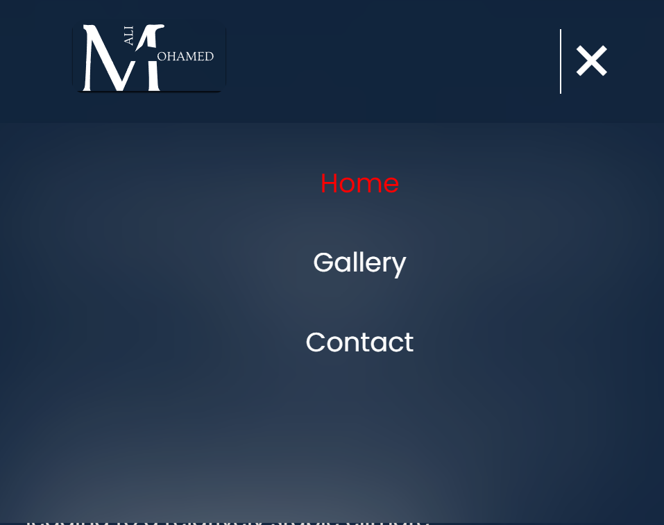

## Gallery

Welcome to our gallery page! Here, you'll find a collection of stunning images of the moon. We've made it easy for you to explore and comprehend the beauty of the moon through these visually impressive pictures.
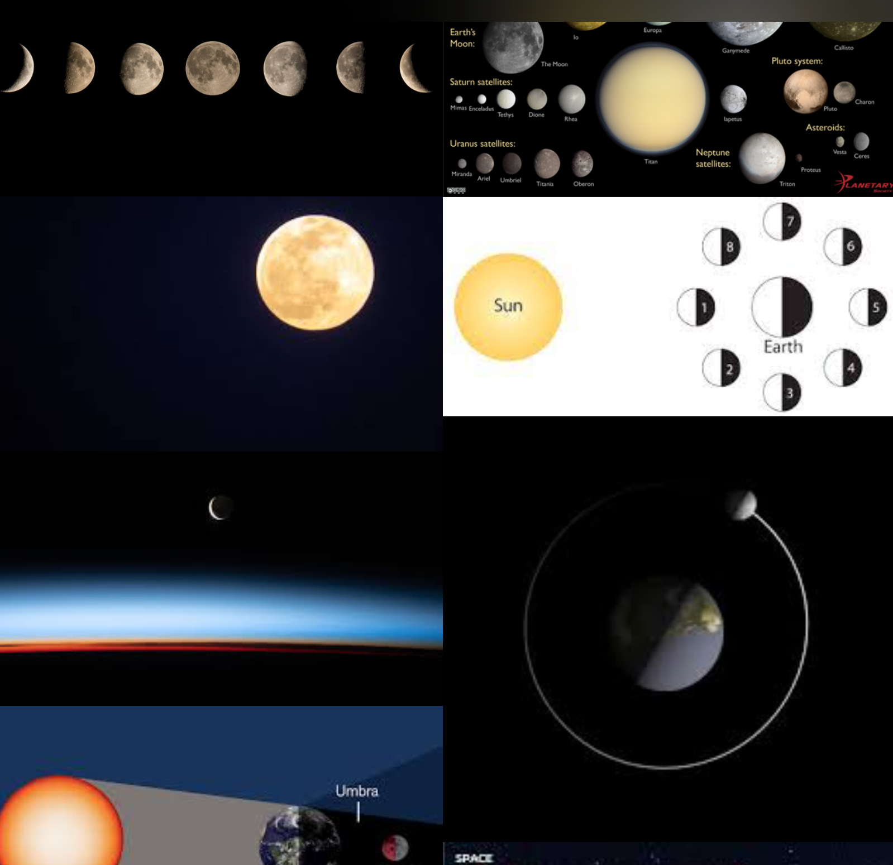

### How to use the gallery

I hope our gallery provides you with a meaningful experience of the moon. Explore and enjoy the pictures!

## Contact Us

Welcome to our "Contact Us" section! If you have any questions, new ideas, discovered issues, or wish to share new facts, this is the place to reach out. We value your feedback and are here to assist.

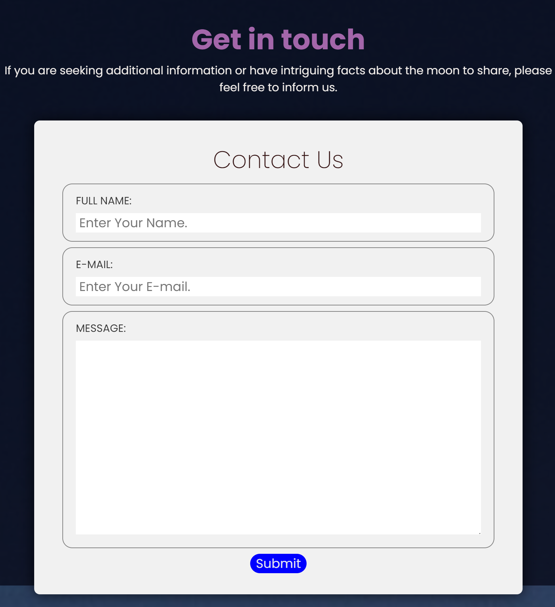

## Footer

Explore more and stay connected with us! Check out our social media profiles for the latest updates, news, and community interactions.

# Future Features
---

- Introduction of a login page where users interested in the moon can log in and post articles about the moon.
- Implementation of a discussion section where users can engage in conversations and share images.
- Creation of a page allowing users to upload and share images.

## Deployment

To deploy github, follow these steps:

1. Navigate to the GitHub repository for **Your Project Name** and go to the **Settings** tab.

2. In the Settings menu, find the **Pages** tab on the left-hand side.

3. Under the **Source** section, select the branch you want to deploy, typically the main or master branch.

4. Click **Save**.

5. Once the selected branch has been chosen, the page will be automatically refreshed, and you'll see a detailed ribbon display indicating the successful deployment.

Now, your project, **Your Project Name**, should be accessible on GitHub Pages!

Note: It might take a few moments for the changes to take effect, and for your site to become live.

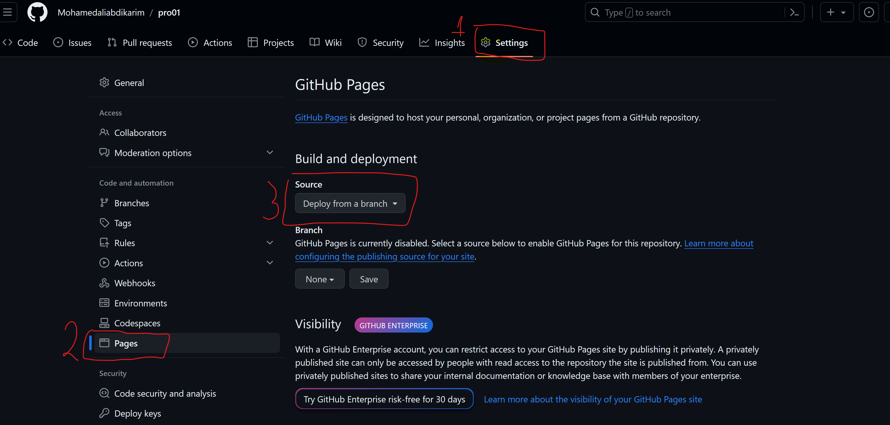

Explore the active GitHub repository by following this link [her](https://github.com/Mohamedaliabdikarim/Projeckt-one)

## To duplicate a repository on GitHub

You can create a duplicate of a GitHub repository by forking the GitHub account. This duplicated version allows you to view and make changes without impacting the original repository. Follow these steps to fork the repository:

- 1. Sign in to your GitHub account and find the desired repository.
- 2. On the right side of the page, adjacent to the repository name, there is a 'Fork' button. Click on this button to generate a copy of the original repository in your GitHub account.
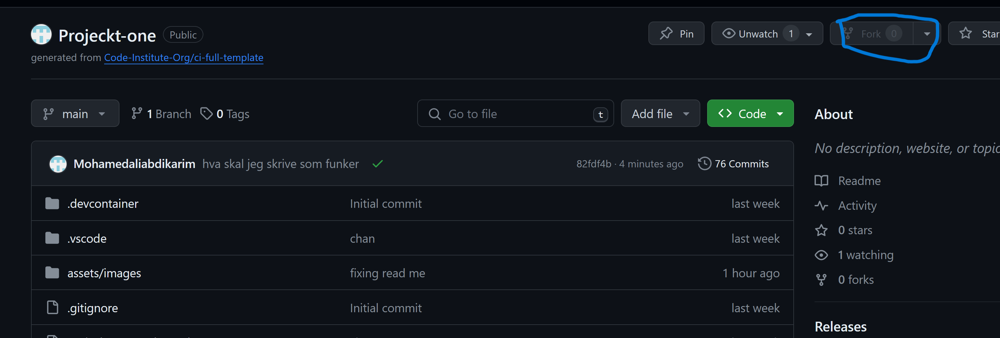

### To generate a local copy of this projec
Here's the process for cloning a project from GitHub:

To generate a local copy of this project

Here's the process for cloning a project from GitHub:

  1. Navigate to the code tab under the repository's name.
  2. In the Clone with HTTPS section, click on the clipboard icon to copy the provided URL.
  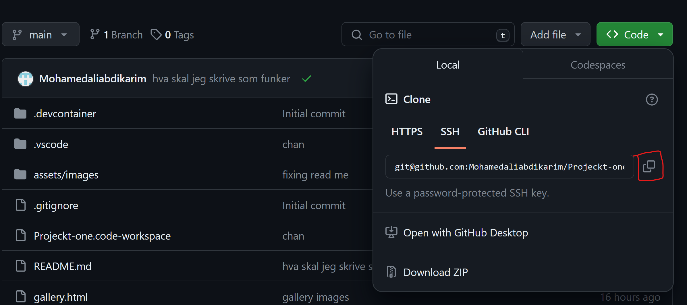

  3. Open Git Bash in your preferred integrated development environment (IDE).
  4. Set the current working directory to the location where you intend to create the cloned directory.
  5. Type "git clone" and then paste the URL copied from GitHub.
  6. Press enter, and the local copy will be successfully created.

# Technologies Used
---
- HTML5 serves as the foundation for the website's content and structure.
- CSS contributes to the overall styling.
- Wireframes are crafted using figma.
-  GitHub is utilized for hosting and editing the website.

### BUGS
I encountered several bugs in my HTML and CSS, which I discovered during validation. The form was not functioning correctly initially

## HTML
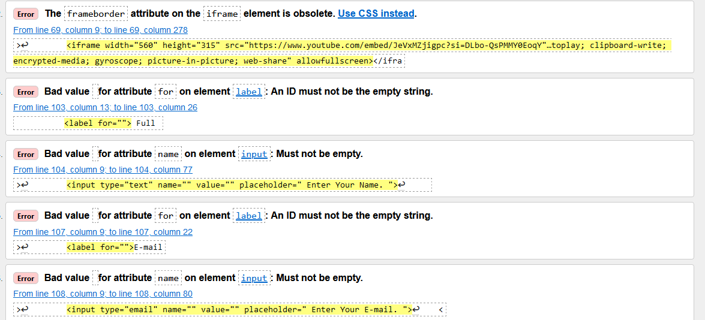 

## CSS
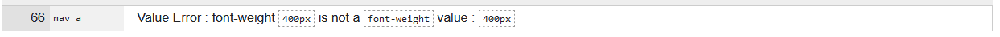

## Validation

### HTML
- Passed W3C HTML validation with no issues.
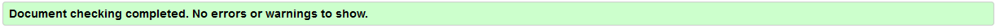
### CSS
- Successfully validated with W3C CSS, free from errors.
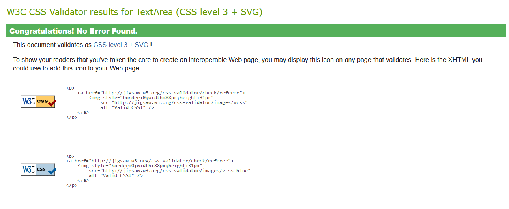

## Testing
The page underwent testing with Google Lighthouse, and you can view the results below
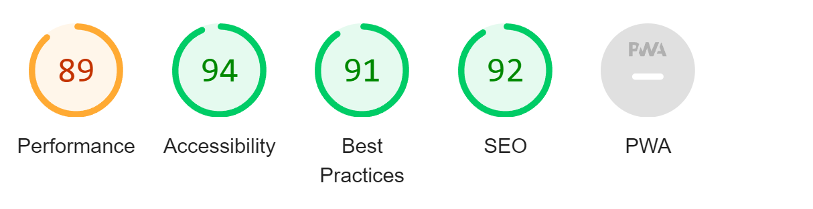

## Credits

content
- font is from [google fonts]('https://fonts.googleapis.com/css2?family=Montserrat&family=Poppins:wght@200;400;700&display=swap')

- icon I made it in [figma ](https://www.figma.com/)

- the text is from [NASA](https://science.nasa.gov/moon/) and [ROYAL MUSEUMS GREENWICH ](https://www.rmg.co.uk/stories/topics/interesting-facts-about-moon)

Media
- All the pictures in the gallery have been retrieved from a Google search.

  - image  [google ](https://lens.google.com/search?ep=iosbcm&re=mf&s=4&p=AbrfA8o7tPrkaWnTPvrZxE_HdMWEGV40z4ep8g20Gw5zP-bRcgxr-nPEPwjXYt_u_qffIj6RsRslxe5gPJ_bgpOXWeOB2oOZAzOgvblKl09tRtrkcLVOWZPg13Gc1LTlK-NUh2bz2HJdJxUJdnXkglo5JiFo4wKjokK1EM8yr7P2eZTiAorUgbL6reThafX1iyl88uPOAtuwX29Io51anabbqZR9FoU0qzQfZFjOHX00L4fj43R4EVIwqkT3bCrs_QBnPD_UlQip6A%3D%3D&pli=1#lns=W251bGwsbnVsbCxudWxsLG51bGwsbnVsbCxudWxsLG51bGwsIkVrY0tKRFJoWkdJME5EWmxMVFU0WmpjdE5HUTVaUzFoT0RBNUxUaGpaVE5oTm1aa01USTBOUklmYjNneVJrMVlWV0ZSUmpCVlRVbG5SM0JuU1V4dVVESkpVVzl4VGpCU1p3PT0iXQ==)

  - image  [google](https://lens.google.com/search?ep=iosbcm&re=mf&s=4&p=AbrfA8q3RHyW6CkdeQZ93ExcVF6RWkcyxaBKH8mRcpEQRfhtEqNiaeUAlmm8qktbXn1mkdb03xUKwn7WgOMc-y3XNdqDEkqaigHu4GshkfgtKfeU6sTaA_6QUR_3tlBrFSLB-taaRi_t0jTFszEwO39GsMCGnv9-Bcn4DP50GtFn55ZgkynuhtDZUWxFXmMzg-e106OZWgEFMnUWpm7PMgCCl2WsPKAviTesrDtFev3QRzSvjrL6j2w6af2U9Uu3RutHJIPaB-7epw%3D%3D#lns=W251bGwsbnVsbCxudWxsLG51bGwsbnVsbCxudWxsLG51bGwsIkVrY0tKRE0zTVRnMU9XSXhMVE5tT0dRdE5EQm1ZaTA1TnpoaUxUbG1PVFZpTldRNE56a3dZUklmWTNjMFp6SlpUSEZXYjNOaVRVbG5SM0JuU1V4dVVESlpSRGQ1VGpCU1p3PT0iXQ==)

   - image  [google](https://lens.google.com/search?ep=iosbcm&re=mf&s=4&p=AbrfA8r7Yi9thw1QqC8kqZmr-TaOlJ78mqdFwCCvPj84704QoPPI4lWkpvOK0AM7GrIFPj4xs9plnFIy7LaF3up6j54KO92uon9wjX22-ZmLG6yr3H6F614mW8aRbfaROeWwjCuGR_tmRS_KIRfZsbWtsm36W0lFJmTbNZ78uc0-IlVmkh5rLUn-uUg_i7o3UKL2wuzml-kUUcwhqNochMxOhNwVabfP8ddQtm-75zsIMuX2OJZFnZyD1uLp7taw0MWseAfih2-HTg%3D%3D#lns=W251bGwsbnVsbCxudWxsLG51bGwsbnVsbCxudWxsLG51bGwsIkVrY0tKR1E1WkRjMlkySXhMV0kwTm1NdE5HUXlZeTA1WVdZMUxUSTNNamt6Wm1VME5qbGtPUklmZDE5SVpYaDBaSHB5ZW1Oa1RVbG5SM0JuU1V4dVVESTBXbVZ0VGpCU1p3PT0iXQ==)

  - image  [google](https://lens.google.com/search?ep=iosbcm&re=mf&s=4&p=AbrfA8p3kychyJbg3MfFrHp4TgiugwHsKNUqtAnhaLZI7QYX1Z4net5qTSs0vE3Zv5pV1bsGolSQJrBXEiJOWbxLJYB0AX3TfXWGc1owQfrFx5LPgeWSdVmsMyrzZKY5Vo_rFGXVVN60VncAhgyDOtUPsWGChsayzuJCXDpJN885YeNjP5juv40A4GXmwGLKZ60ivg1Q7bXQKTRLr7LejMIA492dxLGG3hAe7Z0S_r6AI0HGmycX9b6H-5bTEt9sDoDWoYyrHosyJw%3D%3D#lns=W251bGwsbnVsbCxudWxsLG51bGwsbnVsbCxudWxsLG51bGwsIkVrY0tKR0UwTmpKbFpUSTFMVGMzTTJFdE5HSXhZaTA1WW1WbExURTVPV1F4WVdReE5tUTJOaElmUlRsck5VRnJVMk4wT1VsaVRVbG5SM0JuU1V4dVVERnZkR1o1VGpCU1p3PT0iXQ==)

  - image  [google](https://lens.google.com/search?ep=iosbcm&re=mf&s=4&p=AbrfA8pFfKyjwgsU3Hu2QJSN5Q_waUL7G3qDceH1_H3l4R3yGfoIfCyxJhqlHLpjKTOtvM9HHQ-S49Lm54gWUCxgSUe9LPdNAHJrsZwNvxaqhOaZFF0AVTNEmkdfklQhxUOoTa7Scz_ju10PTyFlGL40ANOXh7DSJHVr-MMfl5Evw2ZKpuAkvTGQtXRZy1se3gRTjuEZSdQBdL3BW4m20XUQdYTUzSUiFlzOxWD7Oq8E7o99h4tlk_Qo8CiMy6inkbdbDqz8Cl7zpA%3D%3D#lns=W251bGwsbnVsbCxudWxsLG51bGwsbnVsbCxudWxsLG51bGwsIkVrY0tKR0ZrWlRsaU1HTTBMV00xWlRrdE5EazFZUzFoWVdGakxUSXlNVE01TUdFd1kySmpaUklmYXpaU05uRnFibEl6VlUxbVRVbG5SM0JuU1V4dVVERnZSbEY1VHpCU1p3PT0iXQ==)

  - image  [google](https://lens.google.com/search?ep=iosbcm&re=mf&s=4&p=AbrfA8rw7axnsdoqUzDOjCZvjBlLQl4peaUS7OdUwu_65Mkvnwy3gCBEM7Bdjg7ha8YiO23XMZc_ABsOrowiDTL2n1wWKqU9dAP-cdh2wFFbGO3EIx6KtAq9NZTFAlNRbxqWaX9DBye3U0elcEUvdfcqrRDgHLouCdghfE3EtOwymWcy3Ynqu91V1pmuqpXANI_MwrkHK3eWwJoXS05T72r0lHUczK7bAYjZWwJdkQQiOuk7yLlOszukKO58lUZeqN0tM2TWHa6Flw%3D%3D#lns=W251bGwsbnVsbCxudWxsLG51bGwsbnVsbCxudWxsLG51bGwsIkVrY0tKREptWXpSa1ltRm1MV1F6TjJNdE5EVTNaUzFoWlRBd0xUWTVZVFEyWmpNMU9UWTFOeElmTkRNM1dFTk5NbkJZT1hOU1RVbG5SM0JuU1V4dVVETkpWVUkyVHpCU1p3PT0iXQ==)

  - image  [google](https://lens.google.com/search?ep=iosbcm&re=mf&s=4&p=AbrfA8ryWQ9f-Q9YGpxOQcTy7HfkD21Hp66iiaSAZbs7351_myFDKgdKeNi7VX_KLw5Zai7P8WulPFgjLMuTtUwgv0JHn_J1LzFkgwhh-evOnfHM3ZiACV0zgPjHRZu7TFLwbv7ytIWt8u5uDI0vWj053wt4LiKRIIYt5LZC7ssgFCxOWdWSIedY6w3kHJtATd_GPFaYdtC3vgqqQGWz91NOLqdRpko2ijNMQZ1Zz111e0SZRBbPmyUBLAjvX8Vy-U4Q-tE_-Jq4Rg%3D%3D#lns=W251bGwsbnVsbCxudWxsLG51bGwsbnVsbCxudWxsLG51bGwsIkVrY0tKR0psWWpabE5HSXpMV0V6TkdZdE5HWTFPQzA0WWpGaUxURTJPR1EyWW1GaU9HTXlZeElmUVhoQlJGWlhUVXg0ZVRoaFRVbG5SM0JuU1V4dVVETkpOVk54VHpCU1p3PT0iXQ==)

   - image  [google](https://lens.google.com/search?ep=iosbcm&re=mf&s=4&p=AbrfA8p9PHTk_S1kJ-ZKKXb-K_FVJWQN4mgV4YHAmXIDjRmqMYFCYFoIFvu8Mi-aVSBe3X4w4EzXYZ4Rxq6_CIacOkMd8wLceWixAYJRkO9dbStgMweuWizEKMmbGTfdvrmUMLL1P_HCOi9Y6Lf4bkbgnE6w1hxmcesgy8OmM4085L1Q_gxZgA2ywjQPrrEaKKErc2iT6byitCr-QucBfOlC9URFPRswfNZpqoln5w4LvXnGQrlx1jCUqd6VDeMn4d39hy4mvpx4-w%3D%3D#lns=W251bGwsbnVsbCxudWxsLG51bGwsbnVsbCxudWxsLG51bGwsIkVrY0tKREppT0dFellURmpMVEV5WVdFdE5EUXlNaTA1T1RReUxXUXlOREppWmpFeVpUUm1NQklmV1ROc2VuQlBSRTFvVERCV1RVbG5SM0JuU1V4dVVERkpPRlJQVHpCU1p3PT0iXQ==)

  - image  [google](https://lens.google.com/search?ep=iosbcm&re=mf&s=4&p=AbrfA8q4ufJ439Th5TVmIdVA1IXEQJNWPCJQWMyiUoTj_Bc159_im14Fz292Qne7NTqPApAY6MsmQw_fjcpOjMiTrIty5Vavgkv6tt3n-Oz4fIybdEN0dRiyCANhZ95R4EMUqIofHBHpMEtLSGmSoSt-mio4A10zT8VR70n5mbHF1_7QwEPN3Fye3i1hav_9W36VZpH4ZRHcH5nezrb3ZnXFMCvxULieYGKTstzTpfnfxgZlYAm5KA9l6uaxy9lxN6CuZjNjVN14ug%3D%3D#lns=W251bGwsbnVsbCxudWxsLG51bGwsbnVsbCxudWxsLG51bGwsIkVrY0tKR1V5T1RjMFlqSTFMVEptWVdFdE5EZzRNQzA0WTJRMExUUTNOVGMxWkdWaE1qSXhaUklmWnpsc1VVbDRSVEJMTXpCa1RVbG5SM0JuU1V4dVVEQTBTblJsVGpCU1p3PT0iXQ==)

Code
- The header and navigation are inspired by and include elements borrowed from [YouTube](https://www.youtube.com/watch?v=yE9DLIoDwCg&t=720s)

- footer was taken forom [LOVE RUNNIG](https://github.com/Mohamedaliabdikarim/love-runer)

## Acknowledgements
This website stands as the culmination of my efforts during the Portfolio 1 Project for the Full Stack Software Developer (e-Commerce) Diploma at the Code Institute. I extend my heartfelt gratitude to my mentor, [Precious Ijege](https://www.linkedin.com/in/precious-ijege-908a00168/), the invaluable Slack community, and everyone at the Code Institute for their unwavering assistance and support throughout this journey. While Wawas Woods is a fictitious entity, its presence is tangible in every aspect except for the business title. At present, it is more than just a project – it is a passion!