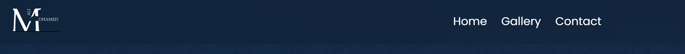

# Moon Explorer

Welcome to Moon Explorer! This webpage is dedicated to providing interesting facts about the moon. Explore the mysteries and wonders of Earth's celestial companion.

Welcome to Moon Explorer! [visit the page ](https://mohamedaliabdikarim.github.io/Projeckt-one/)

## Introduction
Moon Explorer is a web project designed for people fascinated by the moon. Uncover captivating facts and trivia about our cosmic neighbor right here.

## Media
Dive into the moon's mesmerizing visuals with our collection of media content:

## Usage
Navigate through the webpage to discover various moon-related content.[ Click on the media elements to view GIFs and videos, and enjoy the informative text sections](gallery.html).

## Installation
Moon Explorer is a web-based project, and no installation is required. Simply visit the project webpage [here](https://mohamedaliabdikarim.github.io/Projeckt-one/) to start exploring the moon.

## Contributing
Feel passionate about the moon? Contributions are welcome! Fork the repository, make your enhancements, and submit a pull request. Reach out to contact page.

## Contact
Have questions, suggestions, or just want to chat about the moon? Reach out to contact page.

Happy moon exploration!

## Features
Moon website has been designed to provide a welcoming and user-friendly experience. It incorporates familiar elements like a navigation bar and a contact form to enhance ease of use. The overall ambiance of the website aims to be inviting, ensuring a non-intimidating atmosphere that encourages users to explore its content more deeply.

## Navigation Menu:

Positioned at the top of each page on the site, the navigation menu is fully responsive and features links to all pages for effortless navigation from a centralized location. The clickable logo further enriches the user experience by offering a direct link back to the home page, contributing to a seamless and user-friendly website navigation.

## Gallery

Welcome to our gallery page! Here, you'll find a collection of stunning images of the moon. We've made it easy for you to explore and comprehend the beauty of the moon through these visually impressive pictures.

### How to use the gallery

I hope our gallery provides you with a meaningful experience of the moon. Explore and enjoy the pictures!

## Contact Us

Welcome to our "Contact Us" section! If you have any questions, new ideas, discovered issues, or wish to share new facts, this is the place to reach out. We value your feedback and are here to assist.

## Footer

Explore more and stay connected with us! Check out our social media profiles for the latest updates, news, and community interactions.

## Deployment

To deploy github, follow these steps:

1. Navigate to the GitHub repository for **Your Project Name** and go to the **Settings** tab.

2. In the Settings menu, find the **Pages** tab on the left-hand side.

3. Under the **Source** section, select the branch you want to deploy, typically the main or master branch.

4. Click **Save**.

5. Once the selected branch has been chosen, the page will be automatically refreshed, and you'll see a detailed ribbon display indicating the successful deployment.

Now, your project, **Your Project Name**, should be accessible on GitHub Pages!

Note: It might take a few moments for the changes to take effect, and for your site to become live.

Explore the active GitHub repository by following this link [her](https://github.com/Mohamedaliabdikarim/Projeckt-one)

### BUGS
I encountered several bugs in my HTML and CSS, which I discovered during validation. The form was not functioning correctly initially

## HTML
 

## CSS

## Validation

### HTML
- Passed W3C HTML validation with no issues.

### CSS
- Successfully validated with W3C CSS, free from errors.

## Credits

content
- font is from [google fonts]('https://fonts.googleapis.com/css2?family=Montserrat&family=Poppins:wght@200;400;700&display=swap')

- icon I made it in [figma ](https://www.figma.com/)

- the text is from [NASA](https://science.nasa.gov/moon/) and [ROYAL MUSEUMS GREENWICH ](https://www.rmg.co.uk/stories/topics/interesting-facts-about-moon)

Media

**Disclaimer:**
All the images in this gallery were found via Google searches, and unfortunately, I can no longer locate the links to the original sources. I want to emphasize that ownership and rights to these images belong to their respective creators. If you are the owner of any of the images and wish for proper credit or removal, please let me know, and I will take immediate action. Thank you for your understanding.

Code
- The header and navigation are inspired by and include elements borrowed from [YouTube](https://www.youtube.com/watch?v=yE9DLIoDwCg&t=720s).

- footer was taken forom [LOVE RUNNIG](https://github.com/Mohamedaliabdikarim/love-runer)

## Acknowledgements
This website stands as the culmination of my efforts during the Portfolio 1 Project for the Full Stack Software Developer (e-Commerce) Diploma at the Code Institute. I extend my heartfelt gratitude to my mentor, Precious Ijege, the invaluable Slack community, and everyone at the Code Institute for their unwavering assistance and support throughout this journey. While Wawas Woods is a fictitious entity, its presence is tangible in every aspect except for the business title. At present, it is more than just a project – it is a passion!